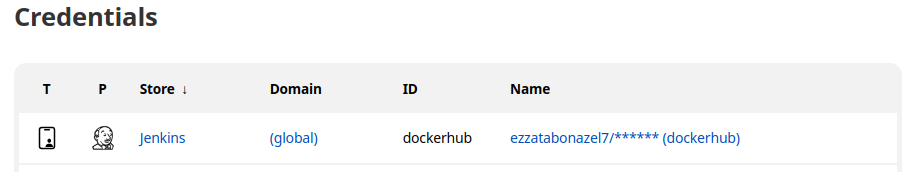
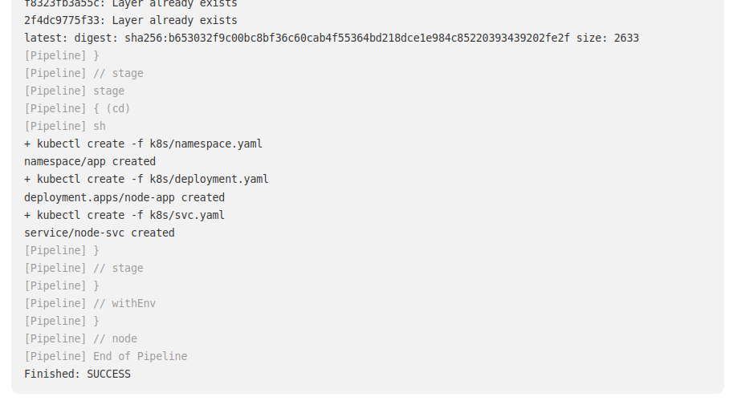

# CI/CD Deploy App using jenkins

## Description
Build a CI/CD Jenkins Pipeline to Deploy a demo node application on GKE cluster 

## Prerequisites
* First we need to create a Kuberenetes Cluster from any cloud service provider
* Second, Jenkins needs to be installed as Kuberenetes deployment


## Steps
1- Dockerfile for your application:

```
FROM node:12
COPY app/nodeapp /nodeapp
WORKDIR /nodeapp
RUN npm install
CMD ["node", "/nodeapp/app.js"]

```

2- In the GCP architecture we use in [Deploy Jenkins On GKE](https://github.com/ezzatabonazel/Deploy-jenkins-on-GKE-cluster.git)


3- create Jenkinsfile:

```
pipeline {
    agent any
    stages {
            stage('ci') {
            steps {
                sh "docker build -t ezzatabonazel7/demo-node -f app/dockerfile ."
                }
            }  
            stage('login') {
            steps {
                 withCredentials([usernamePassword(credentialsId: 'dockerhub', usernameVariable: 'USERNAME', passwordVariable: 'PASSWORD')])
                 {
                    sh "docker login -u ${USERNAME} -p ${PASSWORD}"
                }  
             }
          }   
            stage('push') {
            steps {
                sh "docker push ezzatabonazel7/demo-node"
                }  
            }
            stage('cd') {
            steps {
                sh '''
                kubectl create -f k8s/namespace.yaml
                kubectl create  -f k8s/deployment.yaml
                kubectl create -f k8s/svc.yaml
                '''
            }
            
        }
    }
}  
  
```


4- login to Jenkins and craete username and password credential for your Dockerhub:



5- create a new pipeline and set the git repo:


6- build the pipeline:


### Final Results
* From Jenkins 



* From Dockerhub


* From GKE cluster:
    - namespace created
    - deployment created 
    - service (loadbalancer) created


* From Browser:


